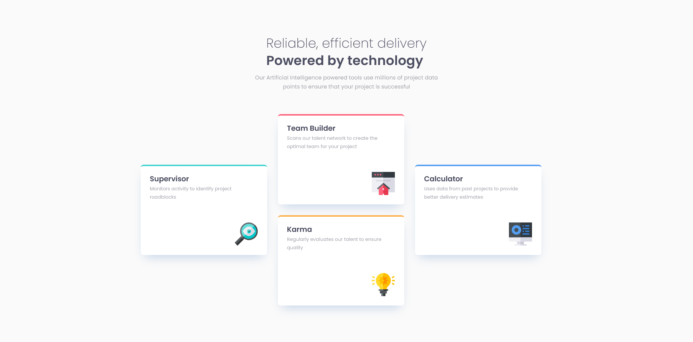

# Frontend Mentor - Four card feature section solution

This is a solution to the [Four card feature section challenge on Frontend Mentor](https://www.frontendmentor.io/challenges/four-card-feature-section-weK1eFYK). Frontend Mentor challenges help you improve your coding skills by building realistic projects.

## Table of contents

-   [Overview](#overview)
    -   [The challenge](#the-challenge)
    -   [Screenshot](#screenshot)
    -   [Links](#links)
-   [My process](#my-process)

    -   [Built with](#built-with)

-   [Author](#author)

## Overview

### The challenge

Users should be able to:

-   View the optimal layout for the site depending on their device's screen size

### Screenshot

### Links

-   Solution URL: [Github](https://github.com/Jojo25011990/four-card-feature-section)
-   Live Site URL: [Github Pages](https://jojo25011990.github.io/four-card-feature-section/)

## My process

### Built with

-   Semantic HTML5 markup
-   SCSS - BEM
-   Flexbox
-   CSS Grid
-   Desktop-first workflow

## Author

-   Frontend Mentor - [Jojo25011990](https://www.frontendmentor.io/profile/Jojo25011990)
-   Instagram - [web.animations.and.effects](https://www.instagram.com/web.animations.and.effects/)
